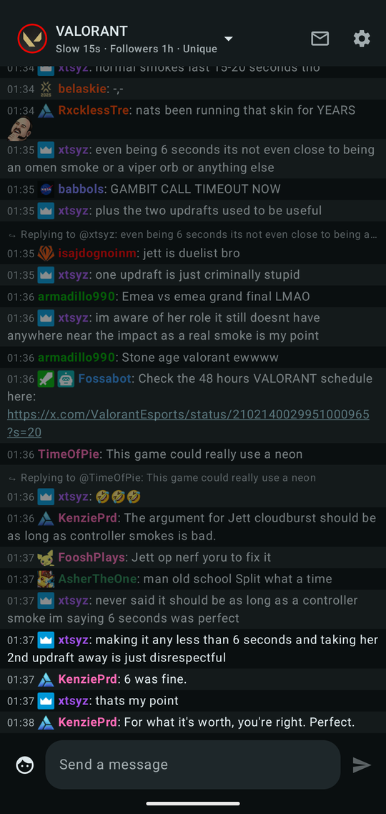
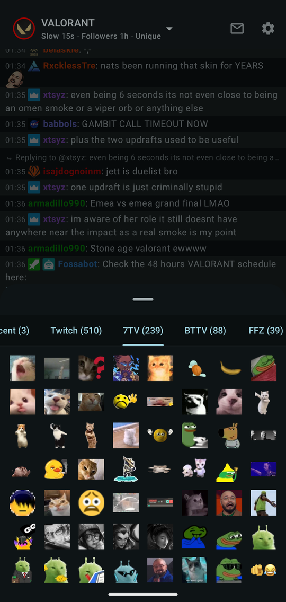
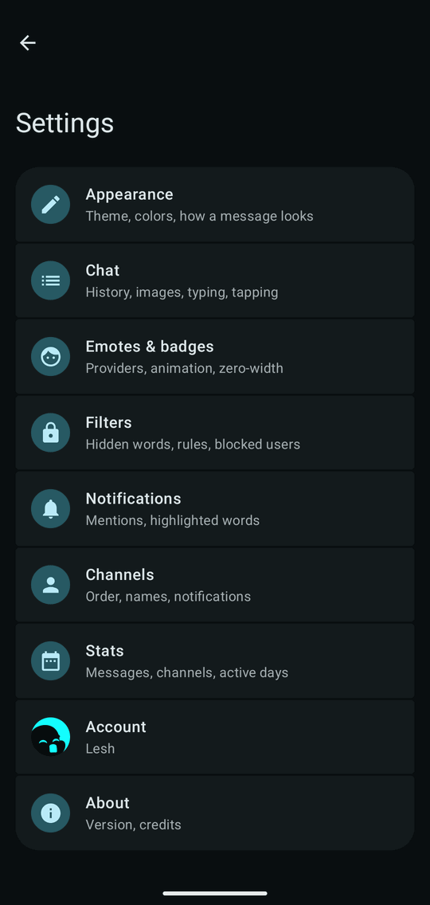
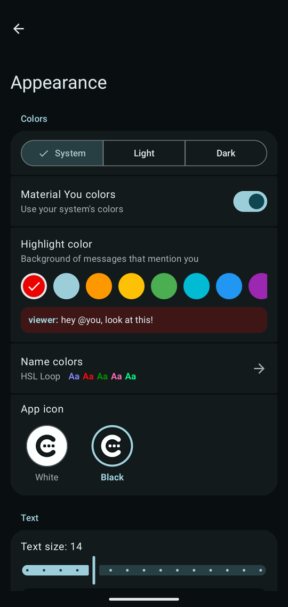

  <picture>
    <source media="(prefers-color-scheme: dark)" srcset="docs/brand/wordmark-dark.svg">
    
  </picture>

  A fast, native Twitch chat client for Android - based on Material 3, with full emote support for a rich chatting experience. 

  For reading and writing chat, not watching.

  
  
  
  
  
  

  
  
  
  

## What it does

**Read chat the way you like it**

- Open several chats and switch seamlessly between them
- Combine multiple chats into one
- 7TV, BetterTTV and FrankerFaceZ emotes, animated, with a picker and autocomplete
- [Recent messages](https://recent-messages.robotty.de/) loaded as you join, so you never walk into an empty room
- Text size, density, timestamps and name colours under your control
- Choose between light and dark themes, Material You, and different app icons

**Never miss being mentioned**

- Mentions and whispers arrive as notifications the moment they are sent, and can be answered
  right there
- An inbox collecting everything addressed to you across all your channels
- Your own highlight words and rules for what deserves an alert, with a sound and vibration per
  channel

**Stay in the conversation**

- Chat bubbles keep a channel floating over whatever else you are doing
- Dedicated whisper and mention inbox
- Switch between several Twitch accounts
- Nicknames for chatters, mute filters, blocking and reporting

**Yours, and nobody else's**

- No account beyond your Twitch login, and no Chatter server behind it
- No ads, no tracking, no analytics - the app only talks to Twitch and the emote providers 
  ([privacy policy](https://derlesh.github.io/Chatter/privacy-policy.html))

## Install

Download the APK from the [latest release](https://github.com/derLesh/Chatter/releases/latest) and
compare it with the SHA-256 published next to it. Chatter needs Android 13 or newer and a Twitch
account.

## License

The source code is public so you can read it, check what the app does and contribute, but Chatter
is not open source. You may build it for your own use; you may not publish it, or use its code in
an app of your own, without asking first. The [LICENSE](LICENSE) has the details.

---

Chatter is an independent app and is not affiliated with, endorsed by or sponsored by Twitch Interactive, Inc.
